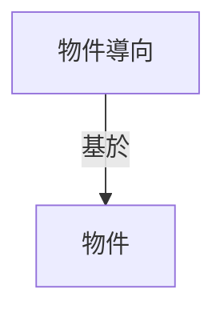

---


# h1
## h2
### h3


---
----


```cpp=
int a = 5
```

```python=
class A(object):
    def __init__():
        
```


----

* 123
* 456
    * 112
* 789
    * abc


1. *斜體*
    * abbbcc
2. **粗體**
    * ddccee
3. ***又粗又斜***
4. ~~刪除縣~~
5. 這是^上標^
6. 這是~下標~
7. ==Highlight==

:::info
這是警告區塊
:::

`this`


* :-1: 
* :cake: 
* 



---

comment
>this is comment[name=張育銘][time=Mon, Feb 19, 2024 11:29 AM][color=#018c11
---